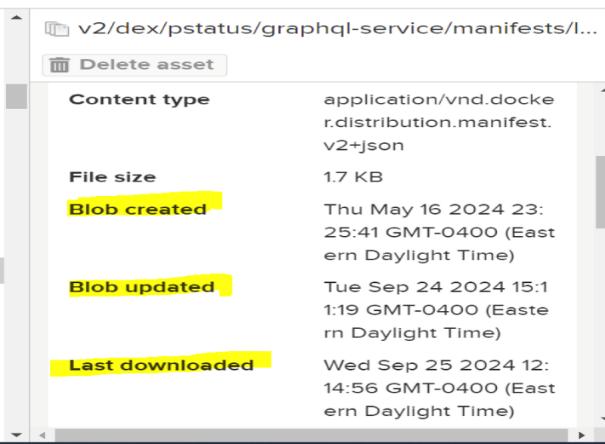
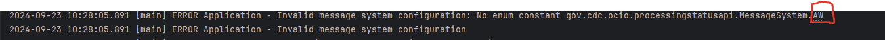

# Complete Product Guide for PHDO PS API 


## **Introduction**	

### Product Overview 

The Public Health Data Observability (PHDO) Processing Status (PS) API is one tool in the broader Centers for Disease Control and Prevention (CDC) Data Exchange(DEX) service offering. It was developed to support public health data senders in their efforts to share critical public health data with internal CDC Programs. Data senders are CDC partners across the country, including:  

* State, tribal, local, and territorial public health authorities    
* Hospitals and health systems    
* Laboratories    
* Trusted Intermediaries 

   
The PHDO PS API is a self-hosted, containerized, and pre-packaged tool for data submission visibility. It is configurable and can be run both locally and in any cloud environment. PHDO PS API was developed to provide visibility into the status, performance, and downstream processing results of file uploads. It enables users to request reports about the status of uploads and to develop custom queries to learn detailed information about the data being uploaded and processed. 

### Key Features 

The PS API has three pillars of functionality: Reports, Queries, and Notifications.   


 

#### Reports 

Reports are an essential component of the data observability aspect of PHDO. In PHDO, data is ingested to the system typically through a file upload. As the upload progresses through the service line, several processing stages occur, including upload, routing, data validation, data transformations, etc. Within each of those stages one or more actions may occur. As data moves through CDC systems, services both internal to PHDO and downstream of PHDO indicate the processing status of these stages through Reports.   
    
For example, one action within the upload stage may be to first verify that all the required metadata associated with the uploaded file is provided and reject it if not. Other upload actions may include the file upload itself or the disposition of the upload for further downstream processing.    

#### Queries 

Queries provide a mechanism to ask questions about processing status using GraphQL, a flexible data query and manipulation language that allows a client to specify what data it wants. Queries can provide a wide range of insights, from the status of an upload to the number of uploads for a given data stream over a period of time. Also available are queries to provide data analysis, such as discovering duplicate file uploads, counts of error messages by type, counts of file uploads by data stream, and more.   
 

#### Notifications 

Notifications are a way for end users to automatically receive a variety of analytical products from the PS API. Some examples include sending an email whenever an upload fails, invoking a webhook to inform a server when downstream processing completes an upload, and sending a daily digest about the number of uploads received by jurisdiction for a given data stream. There are a host of options built into the PS API and an endless number of customized analytical products that can be provided through the dynamic business rules engine.   
 

### System Requirements 

The system requirements for deployment and operation of the PS API will vary depending on the use case. The PS API is designed to be cloud agnostic and is capable of running in Azure and AWS, as well as locally on a single machine.  

When running PS API in the cloud, the requirements of each service will depend on the load on the system. System load includes the rate reports that are coming to the PS API and the number and complexity of concurrent queries.   
   
When running locally, there is an all-in-one option for spinning up all of the services and dependencies of the PS API. This option can be run from docker-compose or pod compose, which means the PS API can be run from Window, Mac, and Linux.  When all of the services are running, approximately 3.5G of memory will be consumed during typical load and 2.5G when idle. The amount of disk space for local deployment and operation of the all-in-one image is around 2GB.   
 

### Endpoint Documentation 

The PHDO PS API is deployed to the cloud for CDC Enterprise use. The endpoints for the staging and production environments are provided below.   
 

##### Detailed Endpoint Descriptions 

| Component  | Staging  | Production  |
| :---- | :---- | :---- |
| **GraphQL Playground (Web App)**  | [https://pstatusgraphql.ocio-eks-stg-ede.cdc.gov/graphiql](https://pstatusgraphql.ocio-eks-stg-ede.cdc.gov/graphiql)  | [https://pstatusgraphql.ocio-eks-prd-ede.cdc.gov/graphiql](https://pstatusgraphql.ocio-eks-prd-ede.cdc.gov/graphiql)  |
| **GraphQL Service**  | [https://pstatusgraphql.ocio-eks-stg-ede.cdc.gov/graphql](https://pstatusgraphql.ocio-eks-stg-ede.cdc.gov/graphql)  | [https://pstatusgraphql.ocio-eks-prd-ede.cdc.gov/graphql](https://pstatusgraphql.ocio-eks-prd-ede.cdc.gov/graphql)  |
| **Report Message Service**  |   |   |

 

##### AWS ARNs for Messaging 

| Staging  | Production  |
| :---- | :---- |
| \<\<insert ARN\>\>  | \<\<insert ARN\>\>  |

 

##### Request and Response Formats (JSON, XML) 

Please see the GraphQL introspection [documentation](https://github.com/CDCgov/data-exchange-processing-status/blob/dev-feature-update-python-scripts/pstatus-graphql-ktor/README.md) for a detailed description of each of the responses for the GraphQL queries and mutations.   
 

##### Status Codes and Error Handling 

* **2xx**: The PS API endpoints will provide 2xx status codes, typically 200 when a request is successful.   
* **400**: A bad request typically occurs when there is a missing or invalid request parameter or body provided.   
* **401**: Only applicable to GraphQL. A 401 is returned when security is enabled and an OAuth JWT token is invalid, expired, or not provided.   
* **403**: Only applicable to GraphQL. A 403 is returned when the JWT token provided does not have permission for the action requested. 

Error handling for the resultant codes should be in place for all the 4xx errors
.   
 

##### Health Checks 

| Component  | Staging  | Production  |
| :---- | :---- | :---- |
| **GraphQL Service**  | [https://pstatusgraphql.ocio-eks-stg-ede.cdc.gov/health](https://pstatusgraphql.ocio-eks-stg-ede.cdc.gov/health)   | [https://pstatusgraphql.ocio-eks-prd-ede.cdc.gov/health](https://pstatusgraphql.ocio-eks-prd-ede.cdc.gov/health)  |
| **Report Sink Service**  | [https://pstatusreport.ocio-eks-stg-ede.cdc.gov/health](https://pstatusreport.ocio-eks-stg-ede.cdc.gov/health)  | [https://pstatusreport.ocio-eks-prd-ede.cdc.gov/health](https://pstatusreport.ocio-eks-prd-ede.cdc.gov/health)  |
| **Notifications Rules Engine Service**  | [https://pstatusnotification.ocio-eks-stg-ede.cdc.gov/health](https://pstatusnotification.ocio-eks-stg-ede.cdc.gov/health)  | [https://pstatusnotification.ocio-eks-prd-ede.cdc.gov/health](https://pstatusnotification.ocio-eks-prd-ede.cdc.gov/health)  |
| **Notifications Workflow Service**  | [https://notifications-workflow-service.ocio-eks-stg-ede.cdc.gov/health](https://notifications-workflow-service.ocio-eks-stg-ede.cdc.gov/health)  | [https://notifications-workflow-service.ocio-eks-prd-ede.cdc.gov/health](https://notifications-workflow-service.ocio-eks-prd-ede.cdc.gov/health)  |

 

### Use Cases 

The PS API can be used independently or in tandem with the Upload API. Within each of these two scenarios, stand-alone or in concert with Upload API, there are a number of use cases.   
   
Regardless of the use case, the PS API brings core capabilities, including: 

* **Data lineage and observability**: PS API enables systems to answer where data is in the service line as it comes in, what happened to it along the way, and whether there are any issues with it.   
* **Asynchronous notifications**: PS API adds the capability of monitoring data as it comes in and triggering emails or calls into other systems when certain events occur. 

 

#### Stand-Alone Use Cases 

When PS API is used independently of other PHDO services like the Upload API, the primary users have their own mechanism for ingesting data into their system. In this configuration, users incorporate PS API as a way to capture and observe the health of their data as it progresses through their service line.   
   
For example, a data processing pipeline may be defined to run in Azure Data Factory (ADF), Databricks, function apps, lambda functions, services running in the cloud, or on prem. There is an endless number of environments that a data pipeline may be running in. The PS API is like a software sidecar that is informed of the status from within whatever environment the user has. Calls are made at various points along the processing timeline into PS API. Those calls can be made via GraphQL or through a messaging system for async or high-bandwidth situations. 
  
   
Below are some of the possible stand-alone use cases: 

* A CDC or state-run program has an existing end-to-end system but wants to augment their current capabilities by leveraging PS API.   
* Any system, not just public health related, is looking to leverage an open-source solution for data lineage and observation. 

 

#### PHDO Use Cases 

PS API can work seamlessly alongside the PHDO Upload API. The Upload API is aware of the PS API and attempts to provide status as an upload occurs. For example, if an upload is rejected because it is missing a manifest, fails to complete uploading, or can’t be delivered once uploaded, those events are automatically relayed to the PS API when the Upload API is used.   
   
Below are some of the possible PHDO use cases: 

* A CDC or state-run program is being created for the first time and wants to get a quick jumpstart on services that are already developed.   
* A CDC or state-run program is modernizing and wants to replace components of their existing system with a robust solution for ingesting data and data observab
ility.  

 

## Installation and Setup 

### General Installation Guidelines 

#### Microservices 

PS API is made up of several microservices that, when deployed together, allow for data upload visibility, report generation, and personalized notifications.   
   
[**GraphQL**](https://github.com/CDCgov/data-exchange-processing-status/tree/develop/pstatus-graphql-ktor): a microservice that can be built as a docker container image to provide reports, dead letter reports, and notifications   
[**Notifications**](https://github.com/CDCgov/data-exchange-processing-status/tree/develop/pstatus-notifications-rules-engine-ktor): a microservice that can be configured to provide customized analytical products through the dynamic business rules engine   
[**Notifications Workflow**](https://github.com/CDCgov/data-exchange-processing-status/tree/develop/pstatus-notifications-workflow-ktor): a workflow orchestration microservice for processing and evaluating the active notification rules using Temporal as its workflow engine 
[**Report-Sink**](https://github.com/CDCgov/data-exchange-processing-status/tree/develop/pstatus-report-sink-ktor): a microservice that listens for messages on Azure Service Bus queues and topics or RabbitMQ queues (for local runs), validates the messages, and persists them to Cosmos DB 
[**Event-Reader-Sink**](https://github.com/CDCgov/data-exchange-processing-status/tree/develop/event-reader-sink): a microservice using Apache Camel to handle message ingestion from different cloud messaging systems and store the messages in the respective storage solutions   
 

##### Image Creation 

The build.gradle file of each microservice contains a code snippet which creates the image using the source code and pushes the image to ImageHub.   


   
   
The highlighted GitHub actions have code with which to build the image and push 
command:   
`./gradlew jib`.     
   
   

   
   
Once the GitHub actions job is complete, you can find images available with [imagehub.](https://imagehub.cdc.gov/#browse/browse:docker-dev2:v2%2Fdex) 


   

 

##### Helm Deployment  

For instructions about deploying and managing PS API microservices in Kubernetes
 using Helm charts, visit the following links: 

* [**GraphQL**](https://github.com/cdcent/data-exchange-pstatus-devops/blob/main/eks/graphql-service/dev/eks-dev-values.yml)   
* [**Reports**](https://github.com/cdcent/data-exchange-pstatus-devops/blob/main/eks/report-service/dev/eks-dev-values.yml)   
* [**Notifications**](https://github.com/cdcent/data-exchange-pstatus-devops/blob/main/eks/notifications-service/dev/eks-dev-values.yml)   
* [**Notifications-workflow**](https://github.com/cdcent/data-exchange-pstatus-devops/blob/main/eks/notifications-workflow-service/dev/eks-dev-values.yml) 

 

#### GitHub Repositories 

For information about building and deploying PS API’s microservices to EKS clusters, visit the following GitHub repositories:    
 

##### ***CDCGov*** 

Users can find general information about PS API and application code in the [CDCGov](https://github.com/CDCgov/data-exchange-processing-status) repository.    
 

##### ***GitHubENT*** 

[GitHubENT](https://github.com/cdcent/data-exchange-pstatus-devops/tree/main.) is a private CDC repository where users can request permission to view folders with relevant configuration files.   
   
**.github Folder**: Users can find workflow files (.yml) to: 

* help build the Docker image from source code, package the Docker image, and securely push the image to ImageHub.    
* scan the source code from CDCgov for vulnerabilities in code using the CDC Fortify tool.   
* securely connect to AWS and Azure Cloud EKS, pull the images from ImageHub, and deploy the Kubernetes clusters for each microservice.   

**AKS/EKS Folders**: Users can find the helm values.yml file, which contains information about:   
* which images to pull    
* which provider to connect   
* what Kubernetes resources to create while deploying the microservice 

 

### Local Installation and Deployment 

#### Docker Container Installation and Deployment 

##### Prerequisites 

* [Docker Desktop](https://docs.docker.com/desktop/)   
* [Docker Compose](https://docs.docker.com/compose/install/)   
* [Git](https://git-scm.com/book/en/v2/Getting-Started-Installing-Git.)   
* **IDEA Plugin**   
  * [IntelliJ IDEA plugin](https://www.jetbrains.com/help/idea/installation-guide.html).
  * [Visual Studio Code IDEA plugin](https://code.visualstudio.com/docs/introvideos/basics).   
* [RabbitMQ](https://www.rabbitmq.com/docs/download.) 

 

##### Step 1: Set Up the RabbitMQ Server  

The following `docker-compose.yml` file sets up a RabbitMQ server running inside
 a docker container.    


 

* **Services**: Defines the individual service that will run as container. In this case, RabbitMQ is the service name and will create a RabbitMQ container.   
* **Image**: Specifies the docker image for the RabbitMQ server. `rabbitmq: management` includes the management plugin that allows access to RabbitMQ’s web-base
d management UI where users can create exchanges and queues and bind queues to the exchanges with the unique routing key.   
* **Port 5672**: Maps the RabbitMQ AMQP protocol port to the host machine. This allows the report-sink service to programmatically connect to the RabbitMQ service and start listening to the configured queue.   
* **Port 15672**: Enables access to RabbitMQ’s web-based UI, `localhost:15672`  
 
* **Environment**: Sets environment variables. If `RABBITMQ_USERNAME` or `RABBITMQ_PASSWORD` is not provided, the default `guest` is used for both. 

##### Step 2: Start the Container 

To start the RabbitMQ container in detach mode, run following command:   
`docker-compose up -d` 

##### Step 3: Check the Logs 

To view the logs and ensure the server is running successfully, run the following command:   
`docker-compose logs rabbitmq` 

##### Step 4: Stop the Container 

To stop and remove the container, run the following command:   
`docker-compose down`   
 

### Cloud Installation and Deployment 

#### AWS Installation and Deployment 

Users can configure AWS resources via terraform. The following GitHub repositories and relevant folders provide more detailed information and resources about this configuration.   
 

##### GitHub Repositories 

[**Terraform-coe**](https://github.com/cdcent/cdc-coe-tf-modules): this repo includes Terraform modules for cloud resources, including Azure and AWS. These module resources are shareable across the projects.    
[**Infra repo**](https://github.com/cdcent/data-exchange-infra): This repo houses the infra code. Under the Terraform folder, you can find the environment folder name, and under that are application-specific folders (e.g., [processing-status](https://github.com/cdcent/data-exchange-infra/tree/main/terraform/dev/processing-status)).   
 

##### Application-Specific Folders 

[App](https://github.com/cdcent/data-exchange-infra/tree/main/terraform/aws/dev/processing-status/app): a folder for AWS applications (e.g., Lambda and FunctionApps).   
[**Data**](https://github.com/cdcent/data-exchange-infra/tree/main/terraform/aws/dev/processing-status/data): a folder for AWS data resources (e.g., SQS, SNS, DynamoDB, and RDS-Postgres).   
[**Network**](https://github.com/cdcent/data-exchange-infra/tree/main/terraform/aws/dev/processing-status/network): a folder for network resources (e.g., VPC, Subnets, SecurityGroup, and ASG).   
   
The below code snippet represents where the Terraform state file stores processing status resources like RDS, DynamoDB, SNS, SQS:   
```json  
backend "s3" { 
    bucket = "cdc-dex-tf-state-dev" 
    key = "psapi/data.tfstate" 
    region = "us-east-1" 
} 
```

To create the AWS resource, navigate to the respective folders and add the .tf(terraform) file. Users can create the Terraform resource for PS API by using the tf module reference code.   


   
 

#### Azure Installation and Deployment 

Similar to AWS, users can configure Azure resources with Terraform. The following GitHub repositories and relevant folders provide more detailed information and resources about this configuration.   
 

##### GitHub Repositories 

[**Terraform-coe**](https://github.com/cdcent/cdc-coe-tf-modules): this repo includes Terraform modules for cloud resources, including Azure and AWS. These module resources are shareable across the projects.    
[**Infra repo**](https://github.com/cdcent/data-exchange-infra): this repo houses the infra code. Under the Terraform folder, you can find the environment folder name, and under that are application-specific folders (e.g., [processing-status](https://github.com/cdcent/data-exchange-infra/tree/main/terraform/dev/processing-status)).   
 

##### Application-Specific Folders 

[**Apps**](https://github.com/cdcent/data-exchange-infra/tree/main/terraform/dev/processing-status/app): a folder for Azure applications (e.g., functionAPP, app insights, and App service plan).    
[**Data**](https://github.com/cdcent/data-exchange-infra/tree/main/terraform/dev/processing-status/data): a folder for Azure data resources (e.g., Cosmo-db, Azure storageaccount, and Servicebus).    
[**Network**](https://github.com/cdcent/data-exchange-infra/tree/main/terraform/dev/processing-status/network): a folder for Azure network resources (e.g., RG, subnets, and SecurityGroups).   
   
To create the Azure resource, navigate to the respective folders and add the .tf (Terraform) file. “Source” refers to the GitHub Terraform module repo. Users can create the Terraform resource for PS API by using the tf module reference code.   


   
 

#### Operating Systems 

Infra, resources, and microservices created and deployed by PS API are supported by Linux-based systems. Windows and MacOS are not supported. 

### Security  

For authentication purposes, PS API supports OAuth 2.0 and JWT (JSON Web Tokens) for secure data transmission between parties. There are no further security measures available.   
 

## OAuth 2.0 Authentication 

PS API supports standard OAuth 2.0 resource provider behaviors, offering flexibility and security based on configuration. When OAuth 2.0 authentication is configured, PS API follows established industry protocols for token validation. 

### Supported Protocols and Standards 

Our system supports the following OAuth 2.0 authentication protocol: 

* **JWT (JSON Web Tokens):** Used for secure data transmission between parties as a JSON object, signed to ensure data integrity. 

### OAuth 2.0 Behaviors for JWT 

When using JWT for authentication, PS API follows these behaviors: 

* **Token Validity**: PS API determines that the JWT token is valid based on standard OAuth 2.0 resource provider assertions.   
* **Signature Validation**: It validates the signature of the JWT using the public key from a configured trusted issuer. The issuer provided by the token alone 
is not trusted without verification from a configured source.   
* **Claim Validation**: Optionally, the system can use configured expected claims within the JWT, depending on the configuration. 

The system will return appropriate HTTP response codes to the requesting party, providing clear feedback on the success or failure of the authentication process. 

## Configuration and Usage 

### PS API System Overview 

The following diagram explores PS API system and network configurations:   


 

### Report-Sinking 

As data is ingested by PS API through a file upload, data processing occurs in stages. Each processing stage generates a processing status report, an essential 
part of PS API’s data observability model.    
   
The processing status report-sink listens for messages, validates the messages, and persists them to one of the supported databases (Azure Cosmos DB, AWS Dynamo DB, Couchbase, or MongoDB). If validation is successful, the message persists under a Reports container. If the validation fails due to missing fields or malformed data, the message persists under a dead-letter container.   

#### Setting Up Databases and Messaging Systems 

Review detailed information about [PS API environment variables](https://github.com/CDCgov/data-exchange-processing-status/tree/develop/pstatus-report-sink-ktor) for databases and messaging systems. 

#### Setting Up GraphQL Mutations 

Review detailed information about [PS API environment variables](https://github.com/CDCgov/data-exchange-processing-status/blob/develop/reports/README.md#graphql-mutations) for GraphQL mutations.   
 

### Terraform Configuration 

### Supported Databases 

##### AWS Databases 

* **AWS DynamoDB**: [Terraform](https://terraform/) code for DynamoDB 

#### Azure Databases 

* **Azure Cosmos DB**: [Terraform](https://terraform/) code for Cosmos DB 

 

#### Supported Messaging Tools 

##### AWS Messaging Tools 

* **Simple Notification Service (SNS)**: [Terraform](https://github.com/cdcent/data-exchange-infra/blob/main/terraform/aws/dev/processing-status/data/sns.tf) code for SNS   
* **Messaging Queue Service (SQS)**: [Terraform](https://github.com/cdcent/data-exchange-infra/blob/main/terraform/aws/dev/processing-status/data/sqs.tf) code for SQS 

##### Azure Messaging Tools 

* **Service Bus**: [Terraform](https://github.com/cdcent/data-exchange-infra/blob/main/terraform/dev/processing-status/app/servicebus.tf) code for Service Bus 

 

#### Supported Monitoring Tools 

##### Prometheus, Grafana, and Loki 

The combination of these tools helps to monitor the Kubernetes infrastructure. The PS API team uses these tools to monitor metrics and create dashboards to visually represent computer and memory usage. 

* [**Grafana**](https://grafana.ocio-eks-dev-ede.cdc.gov/)   
* [**Prometheus**](https://prometheus.ocio-eks-dev-ede.cdc.gov/) 

 

## Notifications 

### Notification Types 

PS API can provide users with both passive and active notifications. To send passive notifications, PS API looks at the content of the individual reports and determines whether a notification is sent based on predetermined rules.    
   
Active notifications are scheduled to examine a subset of data to determine whether a notification gets sent based on predetermined rules (e.g., ADF jobs that mine the Reports database for information).    
 

#### Passive Notifications 

* Notify data senders using intermediaries like IZGW that an upload occurred.   
 
* Notify data providers that an upload completed with processing errors.   
* Notify technical assistants that the system denied an end-user data access.   
 
* Notify technical assistants when an error notification is sent to data provide
rs. 

 

#### Active Notifications 

* Notify data providers if an upload for their jurisdiction has not occurred by 12pm.    
* Send technical assistants a digest of all uploads for a given set of data streams.    
* Send technical assistants a digest of the top errors for a data stream. 

 

### Creating and Configuring Notifications with Temporal 

Temporal is cloud-agnostic, highly scalable, and designed to manage complex, long-running workflows. It can run on any cloud provider or on-premises infrastructure, making it an excellent choice for cloud-agnostic applications.    
 

#### Setting Up and Configuring Temporal 

Review the official [Temporal documentation](https://docs.temporal.io/) for more information about installing Temporal in your preferred environment (self-hosted, cloud, etc.).   
   
**Prerequisites** 

* [Docker](https://docs.docker.com/desktop/)   
* [Docker Compose](https://docs.docker.com/compose/install/) 

 

##### Step 1: Clone the Temporal Docker Repository 

Temporal provides a pre-configured [Docker Compose setup](https://github.com/temporalio/docker-compose.git) that simplifies running Temporal locally.   
 

##### Step 2: Start Temporal Using Docker Compose 

Once inside the cloned docker-compose directory, you can start the Temporal services. 

The `docker-compose up` command will pull and start several containers for different components: 

* **Temporal Server**: the core Temporal service   
* **PostgreSQL**: the database for Temporal's persistence. Essential for Temporal's core operations, including workflow execution, state persistence, and task management   
* **Elasticsearch (optional):** for enhanced search capabilities, including advanced querying and monitoring features 

The services will start on the following default ports: 

* **Temporal Server(gRPC)**: `localhost:7233`   
* **Temporal Web UI**: [http://localhost:8080](http://localhost:8080/) (Elasticsearch needs to be running for this to work) 

 

##### Step 3: Access the Temporal Web UI 

For individuals using Elasticsearch, the Temporal Web UI is available at [http://localhost:8080](http://localhost:8080/). This UI allows you to monitor and manage your workflows, view task queues, and see the status of running and completed workflows.   
 

##### Step 4: Set Up a Ktor Temporal Client in Your Application 

Gradle will help with managing dependencies, building, and configuring your application to add necessary dependencies for both Ktor and Temporal.    
   
**Step 4.1:** Set up a Gradle project   
Generate a Kotlin-based Gradle project using IntelliJ IDEA, or manually create the `build.gradle.kts` file in your project.    
   
**Step 4.2:** Add dependencies   
```json
dependencies {   
 implementation("io.temporal:temporal-sdk:1.9.0")   
}   
```

##### Step 5: Define Workflow Parameters 

Workflows in Temporal are designed to be durable, meaning they can survive process restarts, outages, and other failures. The workflow methods you define in your application will be run within Temporal's managed environment.   
   
**Step 5.1:** Define the workflow interfaces for each scenario!

   
   
**Step 5.2:** Create each workflow method with corresponding implementation   

   
   
**Step 5.3:** Set up a Temporal worker that will poll the Temporal server for tasks and execute workflows   

   
 

##### Infrastructure Setup on Azure 

* Provision VMs which can host Dolphin Scheduler components (e.g., Temporal Server, Temporal Web)   
* Ensure VMs are all on the same VNet for ease of communication   
* Define rules to allow traffic on necessary ports (e.g., 7233 for Temporal services)   
* Azure DB- MySQL/Cosmos/PostgreSQL for metadata persistence   
* Blob Storage account for any files, if required   
* Install Temporal server by cloning Temporal repository ([git clone](https://github.com/temporalio/docker-compose.git))   
* Configure the Temporal by modifying the **docker-compose.yml** to point to your Azure Database for MySQL/PostgreSQL and Azure Blob Storage   
* Start Temporal server using `docker-compose up` command   
* The Temporal Web UI will be accessible on the VM's public IP at the configured port (default is 8088\)   
* Integrate Temporal with Azure AD for identity and access management   
* Use Azure VM Scale Sets or Azure Kubernetes Service (AKS) for scaling Temporal horizontally   
* Use Azure Monitor to track the performance of your Temporal services 

##### Infrastructure Setup on AWS 

* Provision EC2 instances   
* Configure security groups to allow necessary ports (e.g., 7233 for Temporal services, 8088 for Temporal Web)   
* Set up an Amazon RDS instance for storing Temporal's metadata   
* Create a Temporal database    
* S3 for file storage   
* Install Temporal by cloning the repository and using docker compose to start the Temporal server   
* Temporal Web can be accessed via the public IP of the EC2 instance at port 8088   
* Ensure EC2 instances have appropriate IAM roles for accessing RDS, S3, and other AWS services   
* Utilize EC2 Auto Scaling or Amazon ECS with Fargate for scaling Temporal   
* Use CloudWatch for monitoring the performance and health of Temporal services 

##### Using Kubernetes for Cloud-Agnostic Deployments 

* Use Azure AKS or AWS EKS to create a managed Kubernetes cluster   
* Deploy [Temporal](https://github.com/temporalio/helm-charts) using Helm   
* Install Temporalio/Temporal \--generate-name   
* Set up an ingress controller to expose Temporal services   
* Use Azure Files or Amazon EFS for persistent storage, if necessary   
* Integrate the Kubernetes cluster with your cloud database   
* Use Azure Security Center or AWS Security Hub for monitoring and securing your
 deployments 

#### Setting Up Activities Using Temporal Workflows 

Temporal activities allow users to separate application responsibilities, enabling asynchronous execution and providing built-in features like automatic retries
 and timeouts. By using activity stubs in Temporal workflows, you can define tasks that Temporal manages and executes and specify how they should behave. 

##### Activity Types 

* Validating data   
* Processing data   
* Sending email notifications   
* Writing files   
* Writing to a database or blog storage   
* Generating logs   
* Reporting errors 

 

##### How to Set Up Activities 

To set up activities, you must define the tasks that your workflow will execute, write the logic for these tasks, and implement them within your workflow definition. This requires defining the activity stub and pass in the activity class, the activity method, and any timeout and retry options. An example of an activity stub can be seen below.   
   
**Note:** Activities must be implemented as Java classes that define the methods invoked by the workflow, following the activity interface.   
   

 

## GraphQL  

### Overview 

The `pstatus-graphql-ktor` microservice lets users query the PS API to get reports, dead letter reports, and notifications. More information can be found in the GitHub [ReadMe](https://github.com/CDCgov/data-exchange-processing-status/blob/dev-feature-update-python-scripts/pstatus-graphql-ktor/README.md).    
 

#### Setting Up and Configuring GraphQL  

The [Environmental Variable Setup](https://github.com/CDCgov/data-exchange-processing-status/blob/dev-feature-update-python-scripts/pstatus-graphql-ktor/README.md#environment-variable-setup) section under the ReadMe provides a detailed list of environment variables for local development.   
 

##### Step 1: Load the gradle dependencies for the initial setup and launch the application.  

##### Step 2: The application and the respective API can now be accessed for querying in two ways: 

* Via the GraphQL interface using `localhost:8080/graphiql`    
* Via Postman for testing the API 

## Event-Reader-Sink 

### Overview 

Using Apache Camel to route messages, the event-reader-sink microservice is designed to handle message ingestion from different cloud messaging systems and store the messages in respective storage solutions. The event-reader-sink can be integrated with both AWS and Azure services.   
 

* **AWS Integration**: the microservice handles messages from an AWS SQS queue/SNS Topic and stores them in an S3 bucket.   
* **Azure Integration**: the microservice handles messages from Azure Service Bus and stores them in an Azure Blob Storage container. 

 

#### Setting Up and Configuring Event-Reader-Sink 

Follow these [instructions](https://github.com/CDCgov/data-exchange-processing-status/blob/dev-feature-update-python-scripts/event-reader-sink/README.md) to set
 up and configure the PS API event-reader-sink.   
 

## Troubleshooting and Debugging 

### GraphQL 

#### Common Issues and Solutions 

##### Issue: 

The GraphQL service is down.  

##### Solution: 

Verify the status of the service at [http://localhost:8080/graphiql/getHealth](http://localhost:8080/graphiql/getHealth.)   

 

* If the response status is “UP,” the service and the Cosmos database it is connected to are healthy and available. 

 

* If the response status is “DOWN,” the Cosmos database the service is trying to connect to is not available. Users can address Cosmos database connectivity in the following ways:   
* Confirm you are connected to Azure services with Azure login.    
* Confirm you are connected to the correct Azure subscription. 

 

##### Issue: 

The environment variables used in the application are incorrect. This usually happens during initial application setup or when the PS API team introduces a new variable.  

##### Solution: 

Confirm that the environment variables are set up following the [PS API](https://github.com/CDCgov/data-exchange-processing-status/blob/develop/pstatus-graphql-ktor/README.md) guidelines. 

### Notifications 

#### Common Issues and Solutions 

##### Issue: 

The following configuration variable values are incorrect.    

 

##### Solution: 

Ensure these variables are properly configured based on the target environment.  All variables must come from the Azure portal. At minimum, users should include contributor roles in the resource group to get access to the service bus and its settings.   
 

##### Issue: 

The notification service is down, indicated by a “DOWN” response for Azure Service Bus. 

##### Solution: 

Users should run a health check to ensure that the service is healthy and the components used in the service are up and running. If a “DOWN” response is received, confirm that Azure Service Bus is running and that users have access to the service.    

 

##### Issue: 

The notifications service is not sending email notifications due to an invalid SMTP server and port. 

##### Solution: 

Confirm when running and testing the service that the SMTP server and port is valid and the application can send email notifications.   
 

##### Issue: 

The web hook URL is configured incorrectly, and the notifications service cannot send real-time data between systems.  

##### Solution:

Ensure the URL (the endpoint where the server sends the data or payload) is healthy and reachable and that it is properly configured under the application configuration.   
 

#### Temporal Issues and Solutions 

##### Issue: 

Temporal cannot be set up due to missing admin credentials. 

##### Solution: 

After requesting an admin SU account, users can install and set up Docker, GitHub, and Temporal under the SU account.   
 

##### Issue: 

Docker is unavailable due to incorrect installation.   

##### Solution: 

Run the following command to ensure Docker Desktop is installed correctly: `docker-compose version`   
 

##### Issue:  

Docker is unavailable due to missing admin credentials.   

##### Solution: 

Confirm that you are using an admin SU account to run Docker Desktop.   
 

##### Issue:  

The Docker engine is not working and shows the following error message:   


##### Solution: 

After installing Docker Desktop, be sure to restart your machine. If the problem persists, uninstall and reinstall Docker and restart the machine.    
 

##### Issue: 

Containers related to Temporal do not work as expected, due to incorrect installation. 

##### Solution: 

Install and deploy Temporal to the docker containers using Git Bash. Using an admin SU account, install Git Bash and run the following commands to install Temporal as container images in Docker. Complete the following commands to install the Temporal prerequisites:   


 

##### Issue: 

The ports needed for Temporal are in use (e.g., 7233 and 8080). 

##### Solution: 

Ensure these ports are open and not in use, especially by any API or Ktor microservices.    
 

##### Issue: 

The docker-compose GitHub window, which runs in the background and keeps track of the lifecycle of the workflow, was closed.  

##### Solution: 

Keep the Git Bash Docker Compose up and running while Temporal is running inside the Docker container. If the window was closed, run the `docker-compose-up` command to start the Temporal DB server again for workflow tracking and management.
 

### Report-Sink 

Review detailed information about [supported report-sink plugins](https://github.com/CDCgov/data-exchange-processing-status/tree/develop/pstatus-report-sink-ktor).   
 

#### Issues and Solutions for All Report-Sink Modules 

##### Issue: 

The `MSG_SYSTEM` environment variable config has an unsupported value.  

##### Solution: 

Check for MSG\_SYSTEM errors in the following ways: 

1. Check the logs for `MSG_SYSTEM` errors at application startup   

2. Review the /health endpoint   

3. Change the `MSG_SYSTEM` environment variable to `AWS`, `AZURE_SERVICE_BUS`, or `RABBITMQ`. 

 

##### Issue: 

The Cosmos DB database is not reachable due to incorrect `COSMOS_DB_CLIENT_ENDPOINT`.  

##### Solution: 

Check for incorrect environment variable settings for the Cosmos DB endpoint: 

1. The `/health` endpoint status shows “DOWN”   

2. The logs will show the following error:   

3. Correct the `COSMOS_DB_CLIENT_ENDPOINT` and rerun the application. 

 

##### Issue: 

There is an incorrect or missing `COSMOS_DB_CLIENT_KEY`. The `/health` endpoint status for Cosmos DB shows “DOWN” due to incorrect config settings or key regeneration.   


##### Solution: 

Correct the `COSMOS_DB_CLIENT_KEY`. The most recent keys can be found on the Azure Cosmos DB portal.   
 

#### Issues and Solutions for RabbitMQ 

##### Issue: 

The RabbitMQ server inside the Docker container is not running.  

##### Solution: 

Check for server errors in two ways: 

1. Review the `/health` endpoint:   

2. Check the logs for the following message:   

3. Start the RabbitMQ server.   
    

##### Issue: 

An incorrect or missing RabbitMQ queue was provided.   


##### Solution:  

1. Access the RabbitMQ Management UI by navigating to [http://localhost:15672/.](http://localhost:15672/)    
2. Log in and navigate to the “Queues and Streams” tab to see a list of all queues.   
3. Verify your queue by checking that the configured queue is listed. If the queue is not present, you should recreate it.   
    

#### Issues and Solutions for Azure Service Bus 

##### Issue: 

The `SERVICE_BUS_CONNECTION_STRING` is incorrect.  

##### Solution: 

Check for connection string errors in two ways: 

1. The `/health` endpoint status shows “DOWN”   

2. The logs will show the following error:    

3. Correct the connection string. The most recent Azure Service Bus connection string can be found on the AWS console. 

 

##### Issue: 

There is an incorrect or missing `SERVICE_BUS_REPORT_QUEUE_NAME`.  

##### Solution: 

Check for queue name errors in two ways: 

1. The `/health` endpoint status shows “DOWN” for Azure Service Bus   

2. The logs will show the following error   

3. Verify the correct queue name from Service Bus Data Explorer. 

 

##### Issue: 

There is an incorrect or missing `SERVICE_BUS_REPORT_TOPIC_NAME`. The logs will show the following error for an invalid `AWS_REGION`:   


##### Solution: 

Log in to the AWS console and verify the correct option from the region drop down.   

 

##### Issue: 

There is an incorrect or missing `AWS_ACCESS_KEY`. 

##### Solution: 

Check that the config setting includes the correct `AWS_ACCESS_KEY`. If the error persists, log in to the AWS console for the most recent `AWS_ACCESS_KEY` associated with IAM user.    
 

##### Issue:  

There is an incorrect or missing `AWS_SECRET_ACCESS_KEY` for the IAM role. 

##### Solution: 

Check that the config setting includes the correct `AWS_SECRET_ACCESS_KEY`. If the error persists, log in to the AWS console for the most recent `AWS_SECRET_ACCESS_KEY` associated to IAM user.  

### Event-Reader-Sink 

#### Common Issues and Solutions 

##### Issue: 

The appropriate environment variables are not set for the AWS or the Azure environments. 

##### Solution: 

Update the respective environment variable values specific to the environment you are trying to connect to.   
 

##### Issue: 

The AWS Access Key or Secret Key are invalid.   


##### Solution: 

Verify that the specified AWS Access Key or Secret Key are set to the correct values.   
 

##### Issue: 

Unable to establish connection to the AWS Queue/ Topic.   


##### Solution: 

Verify that the specified AWS resources exist and are valid. Set the correct values for the respective environment variables.   
 

##### Issue:  

The AWS region values are unavailable or set up incorrectly.   


##### Solution: 

Verify that the specified AWS resources exist and are valid.   
 

##### Issue: 

The Azure Service Bus queue/topics are unavailable or invalid.   


##### Solution: 

Verify that the specified Azure resources exist, have respective environment configuration values and are valid.   
 

##### Issue: 

The Azure Service Bus connection could not be established due to an invalid service bus environment config value.   


##### Solution: 

Verify and update the respective Azure resources for respective local environment variables and provide the valid values.   
 

## Product Support and Resources 

If you need additional information, have questions, or need to report an incident, please contact the PHDO PS API Team at dexuploadapi@cdc.gov.    

