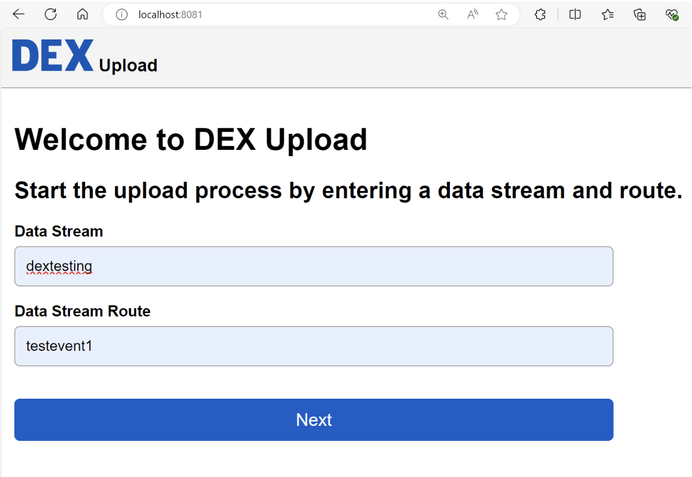
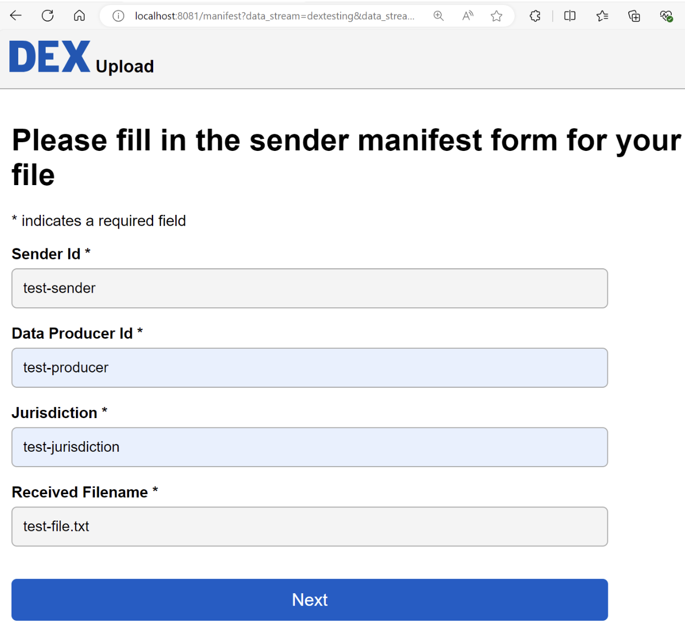
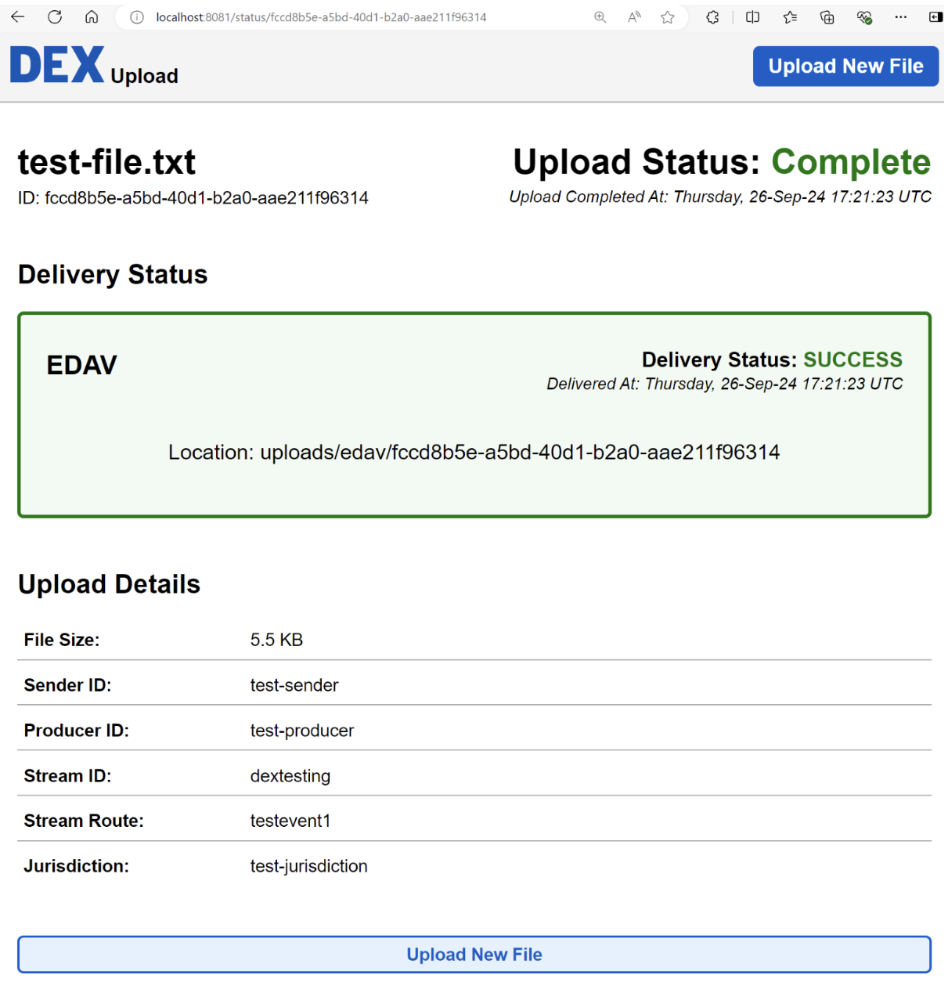
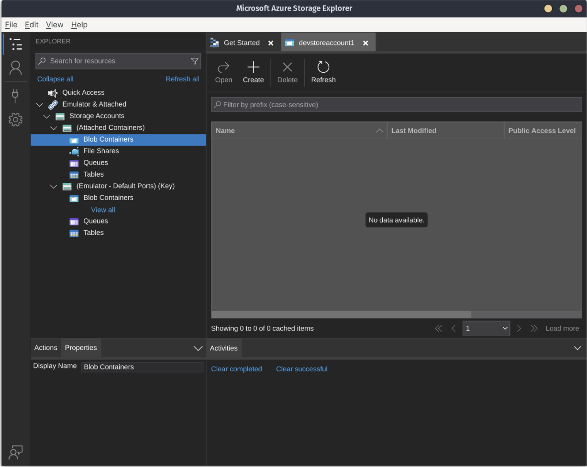
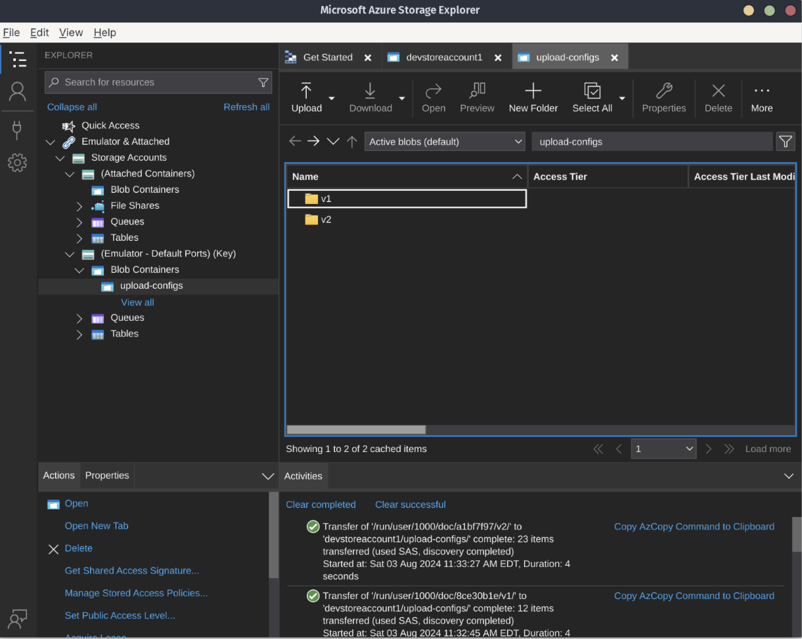

# DEX UPLOAD API Quick Start Guide

Welcome to the DEX Upload API Quick Start Guide! This guide will explain the core features of Upload API and get you working with the application so that you can explore its capabilities.


## Product Overview

The DEX Upload API is an open-source tool that allows users to upload and manage data sets for public health initiatives. It is designed for ease of use and customization while also ensuring compliance with federal standards.

The DEX Upload API is built on[ Tus](https://tus.io/). Tus provides a way to upload files in chunks over HTTP. Each file chunk is sent as an HTTP PATCH request. The last PATCH request tells Tus to combine the chunks into the full file. This is especially helpful in ensuring a robust list of features for Upload API.

### Key Features

* Resumable uploads

* Support for multiple formats (JSON, XML)

* Error handling and status codes

* Detailed documentation for seamless integration

### Endpoint Documentation

You can explore all of [Upload API endpoint information](http://data-exchange-upload/docs%20at%20main%20%C2%B7%20CDCgov/data-exchange-upload%20(github.com)) via the SwaggerUI in our repository.

## Getting Started

Complete the following steps to get started:

### Step 1: Install required tools

__[Download and install Go](https://go.dev/doc/install).__

Run go version to verify you have Go installed.

__[Download and install Docker.](https://docs.docker.com/get-started/)__ \

Docker allows you to run applications (like Azure Storage Explorer) inside containers.

__[Install Azureite](https://learn.microsoft.com/en-us/azure/storage/common/storage-use-azurite?tabs=npm%2Cblob-storage.) __

Azurite allows you to develop and test offline, so you can explore the features of the DEX Upload API on your system. There are several installation options available, so choose the one that works best for you.

__[Install Azure Storage Explorer](https://azure.microsoft.com/en-us/products/storage/storage-explorer/) __

The Azure Storage Explorer helps you manage your blob container storage. You’ll need to have this or a similar service up and running on your system before you start. To best understand and interact with Upload API’s features, it’s important to have a storage location identified.

### Step 2: Clone the Upload API repository

```
git clone <span style="text-decoration:underline;">git@github.com:CDCgov/data-exchange-upload.git</span>
```

After you clone the repository, you can also view all available documents—including user guides—for Upload API via SwaggerUI by opening the "docs/index.html" file.

### Step 3: Change the directory

The code for the upload server lives in the upload-server directory. Let's change directory (cd) to it:

```
cd upload-server
```

### Step 4: Build the Upload server

#### Build the package

```
go build ./cmd/main.go
```

#### Run tests

```
go test ./...
```

##### ___With coverage:___

```
go test -coverprofile=c.out ./... \

go tool cover -html=c.out
```

#### Run locally with no dependencies

##### ___Run the server:___

```
go run ./cmd/main.go
```

Visit [http://localhost:8080](http://localhost:8080/) in a browser to verify success. The following JSON should be displayed:

```json
{ 

    "system": "DEX",

    "dex_product": "UPLOAD API",

    "dex_app": "upload server",

    "server_time": "2024-08-03T10:58:51-04:00"

}
```

### Step 5: Try Out the Built-In Upload Browser UI to Upload a File

The locally running upload API server contains a web user interface running on a separate HTTP port 8081. This UI can be used to test an upload to the locally running upload server.

#### ___Launch the UI in your web browser___

Open this URL link in your browser: [http://localhost:8081](http://localhost:8081/)

#### Enter the data stream and route

Enter the following and then the Next button to continue:

```
Data Stream: "dextesting"

Data Stream Route: "testevent1"
```




#### ___Fill in the sender manifest form___

Enter the following and then the Next button to continue:

```
Sender Id: "test-sender"

Data Producer Id: "test-producer"

Jurisdiction: "test-jurisdiction"

Received Filename: "test-file.txt"
```



#### ___File Uploader___

Choose a file to upload using the __Browser Files__ button or the __Upload New File__ to go back to the beginning page.

Use the file chooser dialog to find and upload the __test-file.txt__ file.

#### Review the delivery status page

After the file is uploaded, you can see the result on the delivery status page.



#### Review the file uploaded on the upload server side

You can review the file next using the command line:

```
ls -d uploads/*/*
```

Output:

```
uploads/edav/fccd8b5e-a5bd-40d1-b2a0-aae211f96314
uploads/events/fccd8b5e-a5bd-40d1-b2a0-aae211f96314_FileReady
uploads/reports/fccd8b5e-a5bd-40d1-b2a0-aae211f96314_blob-file-copy
uploads/reports/fccd8b5e-a5bd-40d1-b2a0-aae211f96314_metadata-transform
uploads/reports/fccd8b5e-a5bd-40d1-b2a0-aae211f96314_metadata-verify
uploads/reports/fccd8b5e-a5bd-40d1-b2a0-aae211f96314_upload-completed
uploads/reports/fccd8b5e-a5bd-40d1-b2a0-aae211f96314_upload-started
uploads/reports/fccd8b5e-a5bd-40d1-b2a0-aae211f96314_upload-status
uploads/tus-prefix/fccd8b5e-a5bd-40d1-b2a0-aae211f96314
uploads/tus-prefix/fccd8b5e-a5bd-40d1-b2a0-aae211f96314.info
uploads/tus-prefix/fccd8b5e-a5bd-40d1-b2a0-aae211f96314.meta
```

In the output, you will see files related to your upload in the following subdirectories:

- __uploads/tus-prefix:__
  - The storage location the file was initially uploaded with the tus protocol.
  - An information file with the .info extension.
  - A metadata file with the .meta extension.

- __uploads/edav:__
  - A storage location that the file was routed to called edav.

- __uploads/events:__
  - Events are stored as files to this directory when running locally.

- __uploads/reports:__
  - Reports are stored as files to this directory when running locally.

## Run locally with Azurite

Use Docker and your Azure Storage Explorer:
```
docker pull mcr.microsoft.com/azure-storage/azurite
```

Create a folder to hold the data that Azurite will store. We'll assume you're using a Linux distribution or Windows Subsystem for Linux v2:

```
mkdir -p \~/data/azurite
```

The -p flag in the command above creates a parent folder if it doesn't already exist.

Run the Docker image, specifying our storage path in the run command:

```
docker run -p 10000:10000 -p 10001:10001 -p 10002:10002  -v ~/data/azurite mcr.microsoft.com/azure-storage/azurite
```

You should see the following confirmation:

```
Azurite Blob service is starting at http://0.0.0.0:10000
Azurite Blob service is successfully listening at http://0.0.0.0:10000
Azurite Queue service is starting at http://0.0.0.0:10001
Azurite Queue service is successfully listening at http://0.0.0.0:10001
Azurite Table service is starting at http://0.0.0.0:10002
Azurite Table service is successfully listening at http://0.0.0.0:10002
```

With Azurite running, opening Azure Storage Explorer will automatically detect Azurite's storage emulator:



Explore the Azure Storage Explorer storage emulator. As you do, your Azurite Docker terminal window should start showing corresponding HTTP requests:

```
10.0.2.100 - - [03/Aug/2024:15:15:09 +0000] "GET /devstoreaccount1?comp=properties\&restype=account HTTP/1.1" 200 -
10.0.2.100 - - [03/Aug/2024:15:15:12 +0000] "GET /devstoreaccount1?comp=list\&include=metadata HTTP/1.1" 200 -
10.0.2.100 - - [03/Aug/2024:15:15:12 +0000] "GET /devstoreaccount1?comp=list\&include=metadata\&timeout=30 HTTP/1.1" 200 -
10.0.2.100 - - [03/Aug/2024:15:15:12 +0000] "GET /devstoreaccount1/%24logs?restype=container HTTP/1.1" 404 -
10.0.2.100 - - [03/Aug/2024:15:15:12 +0000] "GET /devstoreaccount1/%24blobchangefeed?restype=container HTTP/1.1" 404 -
10.0.2.100 - - [03/Aug/2024:15:15:38 +0000] "GET /devstoreaccount1?comp=list\&include=metadata HTTP/1.1" 200 -
10.0.2.100 - - [03/Aug/2024:15:15:39 +0000] "GET /devstoreaccount1/%24logs?restype=container HTTP/1.1" 404 -
10.0.2.100 - - [03/Aug/2024:15:15:39 +0000] "GET /devstoreaccount1/%24blobchangefeed?restype=container HTTP/1.1" 404 -
10.0.2.100 - - [03/Aug/2024:15:15:39 +0000] "GET /devstoreaccount1?restype=service\&comp=properties HTTP/1.1" 200 -
10.0.2.100 - - [03/Aug/2024:15:15:39 +0000] "GET /devstoreaccount1?comp=list\&maxresults=5000\&include=metadata HTTP/1.1" 200 -
10.0.2.100 - - [03/Aug/2024:15:15:39 +0000] "GET /devstoreaccount1/%24logs?restype=container HTTP/1.1" 404 -
10.0.2.100 - - [03/Aug/2024:15:15:39 +0000] "GET /devstoreaccount1/%24blobchangefeed?restype=container HTTP/1.1" 404 -
10.0.2.100 - - [03/Aug/2024:15:15:40 +0000] "GET /devstoreaccount1?comp=list\&include=metadata\&timeout=30 HTTP/1.1" 200 -
10.0.2.100 - - [03/Aug/2024:15:15:40 +0000] "GET /devstoreaccount1/Tables HTTP/1.1" 200 -
```

In order for Upload API to work, you will need to create Azure storage configuration files. Make a new blob container called upload-configs. Then, upload the v1 and v2 folders (located in the GitHub repo's upload-configs folder) to the upload-config blob storage container:

(Azure Upload Configs.png)

